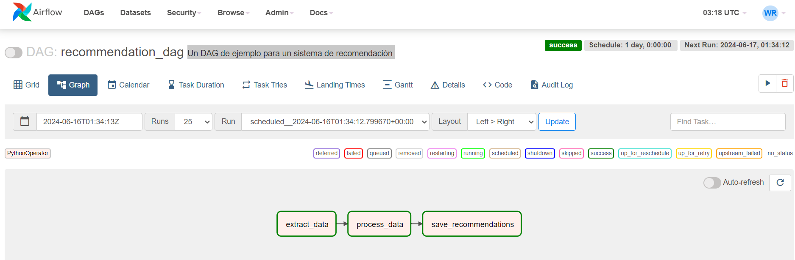

# Recommendation DAG

Un flujo de procesos de recomendación basado en datos del cliente, productos y consumos.

Luego estraer los datos, se procesan y se crean registros en archivos planos, se leen y se genera la recomendación por medio del script en python y posteriormente guarda un archivo plano.

A este flujo de tareas se le pueden agregar variaciones como lo son el envío de correos a los usuarios, actualización de tablas de base de datos o actualización de buckets S3 de AWS para su implementación y actualización de sitios visitados por el consumidor.

<figure><figcaption><p>recommendation_dag flow</p></figcaption></figure>

```python
// python
from airflow import DAG
from airflow.operators.python_operator import PythonOperator
from datetime import datetime, timedelta
import pandas as pd
import numpy as np

# Definimos las funciones para cada tarea
def extract_data():
    # Simulación de extracción de datos
    users = {'user_id': [1, 2, 3], 'name': ['Alice', 'Bob', 'Charlie']}
    interactions = {'user_id': [1, 1, 2, 3, 3], 'product_id': [101, 102, 101, 103, 104]}
    products = {'product_id': [101, 102, 103, 104], 'product_name': ['Product A', 'Product B', 'Product C', 'Product D']}
    
    users_df = pd.DataFrame(users)
    interactions_df = pd.DataFrame(interactions)
    products_df = pd.DataFrame(products)
    
    users_df.to_csv('/opt/airflow/dags/users.csv', index=False)
    interactions_df.to_csv('/opt/airflow/dags/interactions.csv', index=False)
    products_df.to_csv('/opt/airflow/dags/products.csv', index=False)

def process_data():
    users_df = pd.read_csv('/opt/airflow/dags/users.csv')
    interactions_df = pd.read_csv('/opt/airflow/dags/interactions.csv')
    products_df = pd.read_csv('/opt/airflow/dags/products.csv')
    
    # Simulación de un algoritmo simple de recomendación basado en el conteo de interacciones
    recommendations = interactions_df.groupby('user_id')['product_id'].apply(list).reset_index()
    recommendations.columns = ['user_id', 'recommended_products']
    
    recommendations.to_csv('/opt/airflow/dags/recommendations.csv', index=False)

def save_recommendations():
    recommendations_df = pd.read_csv('/opt/airflow/dags/recommendations.csv')
    # Aquí se guardan las recomendaciones en la base de datos o se envían a los usuarios
    # Simulación: simplemente imprimimos las recomendaciones
    print(recommendations_df)

# Definimos los argumentos por defecto del DAG
default_args = {
    'owner': 'airflow',
    'depends_on_past': False,
    'email_on_failure': False,
    'email_on_retry': False,
    'retries': 1,
    'retry_delay': timedelta(minutes=5),
}

# Definimos el DAG
dag = DAG(
    'recommendation_dag',
    default_args=default_args,
    description='Un DAG de ejemplo para un sistema de recomendación',
    schedule_interval=timedelta(days=1),
    start_date=datetime(2024, 6, 14),
    catchup=False,
)

# Definimos las tareas
extract_task = PythonOperator(
    task_id='extract_data',
    python_callable=extract_data,
    dag=dag,
)

process_task = PythonOperator(
    task_id='process_data',
    python_callable=process_data,
    dag=dag,
)

save_task = PythonOperator(
    task_id='save_recommendations',
    python_callable=save_recommendations,
    dag=dag,
)

# Definimos las dependencias entre las tareas
extract_task >> process_task >> save_task
```

<figure><figcaption></figcaption></figure>
