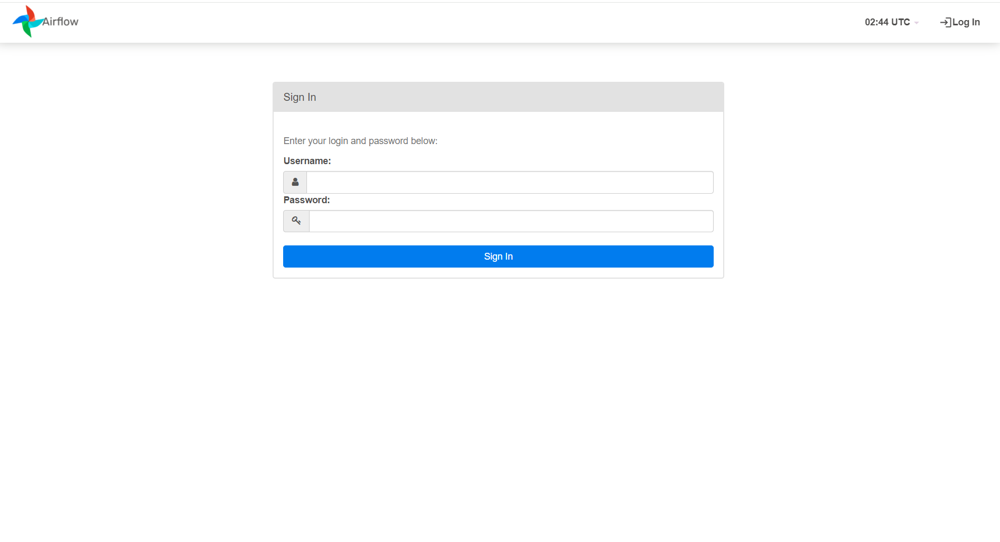
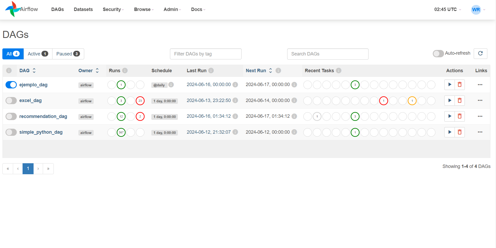
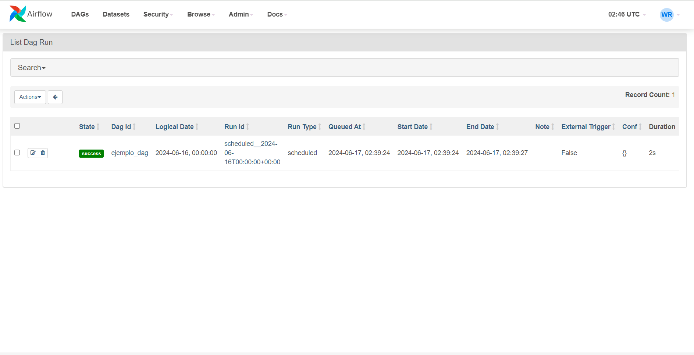
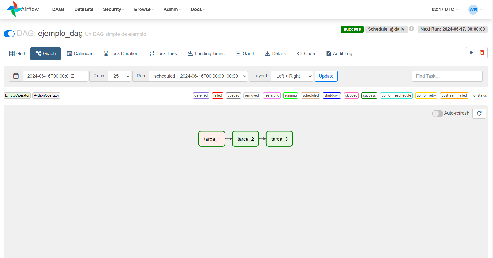
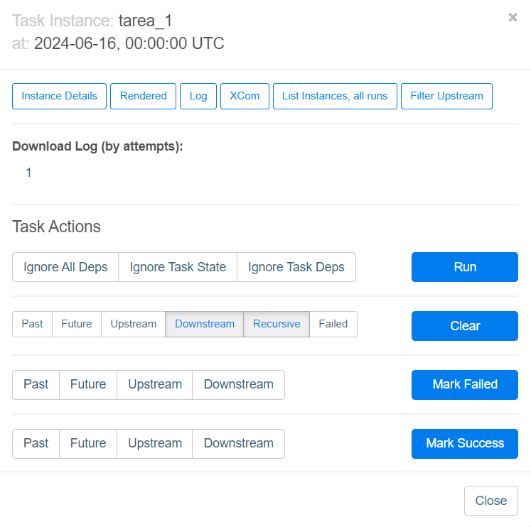
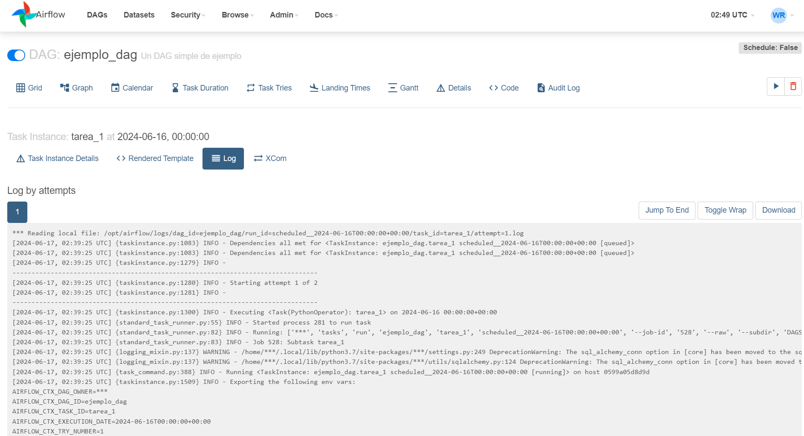
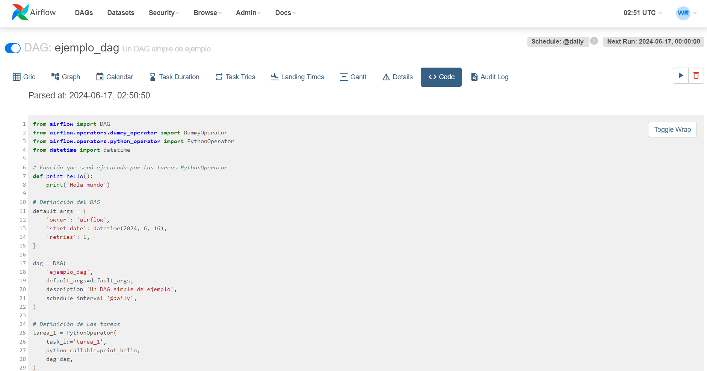

# Visualización del DAG


```
tarea_1 -> tarea_2 -> tarea_3

```

#### Acceso al dashboard de flujos de airflow





<figure><figcaption><p>Autenticación</p></figcaption></figure>





<figure><figcaption><p>Home</p></figcaption></figure>





<figure><figcaption><p>List Dag Run</p></figcaption></figure>



<figure><figcaption><p>Task Flow</p></figcaption></figure>





<figure><figcaption><p>Task</p></figcaption></figure>






<figure><figcaption><p>Log Audit</p></figcaption></figure>





<figure><figcaption><p>Code View</p></figcaption></figure>


